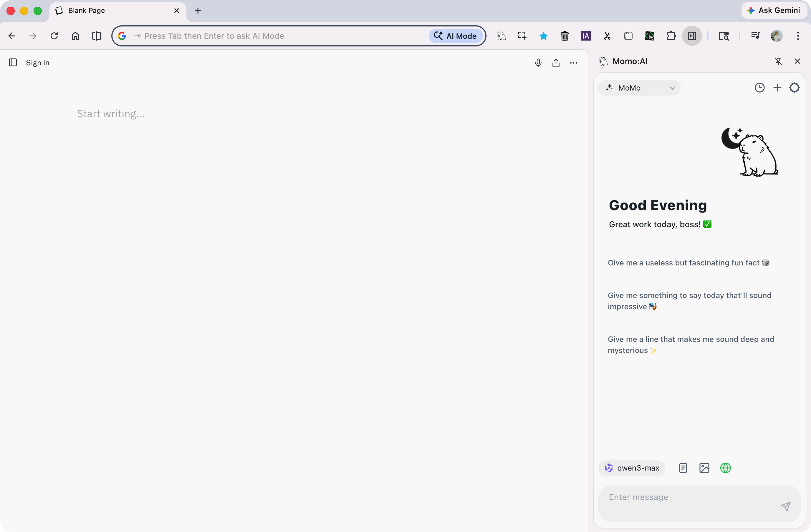

# 🐹 Hii~ Momo: AI Assist

繁體中文 | [English](README.md)

🐹 **嘿，夥伴！來認識 Momo** — 你的瀏覽器裡，住著一隻溫暖的小夥伴。Hii~ Momo: AI Assist 是一款由設計師打造的 Chrome 側邊欄，相信 AI 工具不該只有功能，更該有溫度、有個性、有陪伴感 ✨。可選 **12+ AI 供應商** 🤖（含 Groq、Hermes Beta、OpenClaw Beta 等）、**聯網搜尋** 🔍、**頁面擷取與引用** 📄、**圖片上傳與理解** 🖼️、**系統 TTS 語音朗讀** 🔊，並能 **自調字體大小與字粗、方便閱讀** 👁️；介面支援 **繁中 / 簡中 / English** 🌐，還有 **浮球快捷** 🎈、**自訂提示詞**、**聊天記錄** 與 **快捷鍵** — 一切都在一個小小的側邊欄裡，像跟朋友聊天一樣自然 💬



## ✨ 功能

- 🤖 支援 12+ AI 供應商（OpenAI、Google Gemini、DeepSeek、Qwen、Ollama、LM Studio、OpenRouter、NVIDIA、Groq、MiniMax、Moonshot、Hermes Beta、自訂）
- 🧪 OpenClaw（Beta）— WebSocket AI 閘道器，支援本地裝置間通訊
- 💬 側邊欄聊天介面
- 🎈 浮球快速啟動
- 📄 網頁內容擷取與引用
- 🔍 聯網搜尋（DuckDuckGo、Brave、Tavily）
- 🖼️ 圖片上傳與理解
- 🔊 語音朗讀（系統 TTS）
- 📝 自訂系統提示詞
- 🗂️ 聊天記錄管理
- 🌐 多語言介面（繁中 / 簡中 / English）
- ⌨️ 快捷鍵支援
- 👁️ 可調整字體大小、字粗，方便閱讀

## 🧪 Hermes Agent（Beta）介紹

Hermes Agent 是一個可本地運行的 AI Agent 伺服器。  
在 Hii~ Momo: AI Assist 中，你可以把它當作「本地專屬助理」來用：資料可留在自己的環境、延遲低、可自管 gateway 與金鑰。

- 預設 Base URL：`http://127.0.0.1:8642/v1`
- 預設模型：`hermes-agent`
- 連線方式：OpenAI 相容 HTTP API（非 OpenClaw 的 WebSocket）

### Hermes 快速上手

1. 在 Hermes `.env` 啟用 API Server：

```env
API_SERVER_ENABLED=true
API_SERVER_HOST=0.0.0.0
API_SERVER_PORT=8642
API_SERVER_KEY=<your-secret-key>
API_SERVER_CORS_ORIGINS=*
```

2. 重啟 Hermes Gateway。  
3. 開啟 Momo 設定頁，選擇 **Hermes (beta)**。  
4. 按 **Connect** 測試連線，通過後啟用 `hermes-agent`。  
5. 若出現 401/403，先檢查 `API_SERVER_KEY` 與 CORS 設定是否一致。

## 🆓 免費 API 供應商

無需信用卡，幾分鐘即可開始使用：

| 供應商 | 免費模型 | 頻率限制 | 申請 API Key | 模型列表 |
|--------|---------|---------|-------------|---------|
| **Ollama Cloud** | minimax-m2.7、kimi-k2.5 等 | 單一並行任務，GPU 配額每 5 小時 / 7 天重置 | [ollama.com/settings/keys](https://ollama.com/settings/keys) | [List](https://ollama.com/v1/models) |
| **Google AI Studio** | gemini-3-flash-preview、gemini-3.1-flash-lite-preview | 每日 1,500 次 / 每分鐘 15 次，最高 100 萬 Token 上下文 | [aistudio.google.com/api-keys](https://aistudio.google.com/api-keys) | [List](https://ai.google.dev/gemini-api/docs/models) |
| **Groq** | Llama 3.3、DeepSeek-R1 | 每分鐘 ~30 次 / 每日 14,400 次，全球頂尖推理速度 | [console.groq.com/keys](https://console.groq.com/keys) | [List](https://console.groq.com/docs/rate-limits) |
| **NVIDIA NIM** | 標註「Free Endpoint」的模型 | 每分鐘 ~40 次，無總量限制 | [build.nvidia.com/settings/api-keys](https://build.nvidia.com/settings/api-keys) | [List](https://build.nvidia.com/models) |

> **API 端點**：Ollama Cloud `https://ollama.com/v1` · Google AI `https://generativelanguage.googleapis.com/v1beta` · Groq `https://api.groq.com/openai/v1` · NVIDIA `https://integrate.api.nvidia.com/v1`

## 📦 安裝

### 從 Release 下載

1. 📥 到 [Releases](https://github.com/tomideas/momo-assist/releases) 下載最新的 `momo-ai-*-chrome.zip`
2. 📂 解壓縮
3. 🌐 開啟 Chrome，前往 `chrome://extensions/`
4. 🔧 開啟「開發人員模式」
5. 📁 點擊「載入未封裝項目」，選擇解壓縮後的資料夾
6. 🐹 點擊工具列上的 Momo 圖示開始使用

### 從原始碼安裝

1. 🔗 Clone 此專案
2. 🌐 開啟 Chrome，前往 `chrome://extensions/`
3. 🔧 開啟「開發人員模式」
4. 📁 點擊「載入未封裝項目」，選擇 `sider/` 資料夾

## 📖 說明文件

使用者說明書（HTML，由 GitHub Pages 發佈）：

👉 [tomideas.github.io/momo-assist](https://tomideas.github.io/momo-assist/)

原始檔在 [`docs/`](docs/)。本機預覽見 [`docs/README.md`](docs/README.md)。

## 🗂️ 專案結構

```
sider/              # 🧩 Chrome 擴充功能原始碼
├── manifest.json   # 📋 MV3 manifest
├── background.js   # ⚙️ Service worker
├── sidepanel.*     # 💬 側邊欄 UI
├── options.*       # 🔧 設定頁面
├── assets/         # 🎨 圖示、i18n 翻譯
├── js/             # 🧠 核心模組
└── libs/           # 📚 第三方函式庫
docs/               # 📖 說明文件網站
```

## 📄 授權

MIT License
